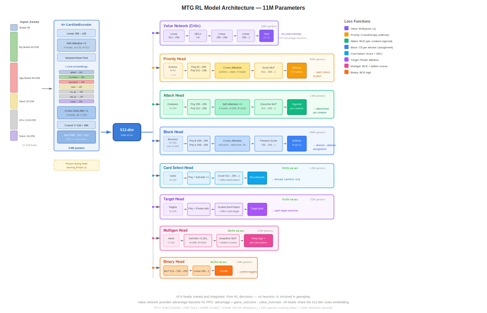

# Learning to Play Magic: The Gathering Through Hierarchical Reinforcement Learning with Transformer-Based State Encoding

**Authors:** M. Austin, with architectural design and implementation assistance from Claude (Anthropic)

**Date:** March 2026

---

## Abstract

We present a reinforcement learning system for playing Magic: The Gathering (MTG), arguably the most complex widely-played strategy card game in existence. MTG presents unique challenges for AI: a combinatorial action space with over 32,000 unique cards, hidden information, stochastic elements, and deeply nested interactions between game mechanics. Our approach employs a hierarchical architecture with a shared transformer-based game state encoder and specialized decision heads for each major action type (spell casting, combat, card selection). We bootstrap the system through imitation learning on a heuristic AI opponent, then improve via Proximal Policy Optimization (PPO) self-play with curriculum learning. We describe the full system architecture, feature engineering, training pipeline, and results on the open-source Forge MTG game engine. From 1,000 heuristic AI games we collect ~127,000 decision records across all 7 decision types. All decision heads achieve strong imitation accuracy (priority 95.7%, attack 82.8%, target 74.3%, block 64.2%, mulligan 99.0%, binary 80.9%, card select 76.5%). The trained model is deployed via ONNX for real-time play in the Forge GUI without Python dependency.

---

## 1. Introduction

### 1.1 Magic: The Gathering as an AI Challenge

Magic: The Gathering (MTG), created by Richard Garfield in 1993, is a collectible card game played by over 40 million people worldwide. From a game-theoretic perspective, MTG is remarkable in its complexity:

- **Massive state space.** A game state includes two players' life totals, hands (hidden), libraries (ordered, hidden), graveyards, exile zones, the battlefield (with permanents that may be tapped, have counters, attachments, and modified attributes), and a stack of spells and abilities awaiting resolution. Conservative estimates place the state space at 10^(100+), far exceeding chess (~10^47) or Go (~10^170 legal positions).

- **Enormous action space.** At any priority window, a player may cast spells, activate abilities, or pass. Each spell may require targeting decisions, mode selections, cost payment choices, and responses to triggered abilities. The branching factor at a single decision point regularly exceeds 100 and can reach thousands.

- **Hidden information.** Players cannot see opponents' hands or library ordering, requiring probabilistic reasoning about unknown cards.

- **Card diversity.** Over 27,000 unique cards have been printed, with approximately 32,300 implemented in the Forge game engine. Each card introduces unique rules text that modifies the game's mechanics, creating a long tail of rare interactions.

- **Deep strategic planning.** Games last 5-50+ turns, with each turn comprising multiple phases (untap, upkeep, draw, main, combat with sub-phases, second main, end). Resource management (mana), tempo, card advantage, and board control create layered strategic considerations.

These properties make MTG significantly harder than games previously conquered by AI. Chess and Go have large but manageable state spaces with perfect information. StarCraft II, perhaps the closest analogue in AI research, has hidden information and large action spaces but a fixed set of units and buildings. MTG combines all of these challenges with an effectively unbounded rule set that grows with each new card printed.

### 1.2 Prior Work

**Classical game AI.** AlphaGo (Silver et al., 2016) and AlphaZero (Silver et al., 2018) demonstrated that deep reinforcement learning with Monte Carlo Tree Search (MCTS) can master perfect-information games. AlphaStar (Vinyals et al., 2019) extended this to the imperfect-information, real-time domain of StarCraft II using population-based training and league play.

**Card game AI.** Libratus and Pluribus (Brown & Sandholm, 2017, 2019) achieved superhuman performance in poker through counterfactual regret minimization, exploiting poker's relatively constrained action space. Hearthstone, a digital card game inspired by MTG but with substantially simpler rules, has been the subject of several AI efforts (Hoover et al., 2020; Santos et al., 2017) using neural network function approximation with MCTS.

**MTG-specific work.** Previous MTG AI efforts have been limited primarily to heuristic systems. The Forge game engine (Card-Forge project, 2007-present) implements a sophisticated heuristic AI with card-specific evaluation functions, lookahead simulation, and tunable personality profiles. Academic work on MTG AI includes genetic algorithm-based deck building (Ward & Cowling, 2009) and limited MCTS-based play (Cowling et al., 2012). To our knowledge, no prior work has applied deep reinforcement learning to MTG with the full rules engine and card pool.

### 1.3 Contributions

We make the following contributions:

1. **A hierarchical RL architecture** for MTG that decomposes the decision problem into specialized heads for each action type, sharing a common game state encoder.

2. **A transformer-based game state encoder** that uses per-zone set attention over variable-length card collections, capturing board relationships between permanents.

3. **An efficient integration** with the Forge MTG game engine (Java) via a JSON-over-TCP bridge to a Python model server, enabling headless parallel game execution at 1.6 games/second across 16 threads.

4. **A trajectory recording system** that captures heuristic AI decisions with full game state and action features via the game engine's event bus, without modifying the core AI logic.

5. **Results** demonstrating that all 7 decision heads learn to predict heuristic AI choices with high accuracy (64-99%), and the model can be deployed via ONNX for real-time play in the Forge GUI.

---

## 2. System Architecture

### 2.1 Overview

Our system comprises four major components:

1. **Game Engine (Java).** The Forge MTG engine handles all game rules, card interactions, and state management. We run it headlessly for data collection and evaluation.

2. **Feature Extraction (Java).** `GameStateEncoder`, `CardFeatures`, and `ActionEncoder` classes convert rich game objects into fixed-size numerical feature vectors suitable for neural network input.

3. **Neural Network (Python/PyTorch).** The `MTGModel` combines a shared transformer encoder with specialized decision heads and a value network.

4. **Training Pipeline (Python).** Data loading, training loops, and evaluation scripts with GPU acceleration (AMP on NVIDIA RTX 3080).

The architecture is designed around the insight that MTG decisions are heterogeneous — choosing which spell to cast is fundamentally different from choosing which creatures to attack with, which is different from choosing which cards to discard. Rather than forcing all decisions through a single network, we use specialized heads that share a common understanding of the game state.

### 2.2 Game State Representation

#### 2.2.1 Global Features (96 dimensions)

The global feature vector captures non-card-specific game state:

| Index | Feature | Normalization |
|-------|---------|---------------|
| 0 | Player's life total | [0,1] over [-10, 40] |
| 1 | Opponent's life total | [0,1] over [-10, 40] |
| 2-3 | Poison counters (both players) | [0,1] over [0, 10] |
| 4 | Turn number | [0,1] over [0, 30] |
| 5 | Active player flag | {0, 1} |
| 6-18 | Current phase (one-hot, 13 phases) | {0, 1} |
| 19-20 | Hand sizes (both players) | [0,1] over [0, 15] |
| 21-22 | Library sizes (both players) | [0,1] over [0, 60] |
| 23-24 | Creature counts (both players) | [0,1] over [0, 20] |
| 25-28 | Total power/toughness (both) | [0,1] over [0, 60] |
| 29-31 | Land counts (untapped, tapped, opponent) | [0,1] over [0, 15] |
| 32 | Stack size | [0,1] over [0, 10] |
| 33-35 | Phase convenience flags | {0, 1} |
| 36-41 | Available mana in pool by color (WUBRGC) | [0,1] over [0, 10] |
| 42-47 | Producible mana from untapped permanents (WUBRGC) | {0, 1} |
| 48 | Total available mana (pool + untapped lands) | [0,1] over [0, 15] |
| 49 | Spells cast this turn | [0,1] over [0, 10] |
| 50 | Lands played this turn | [0,1] over [0, 2] |
| 51 | Opponent lands untapped | [0,1] over [0, 15] |
| 52-53 | Nonland permanent counts (both players) | [0,1] over [0, 30] |
| 54 | Is sorcery speed (main phase + active player) | {0, 1} |
| 55 | Opponent untapped creatures | [0,1] over [0, 20] |
| 56 | Reserved | 0 |
| 57 | Opponent max creature power | [0,1] over [-5, 20] |
| 58-63 | Reserved | 0 |
| 64-69 | Color devotion (WUBRGC) | [0,1] over [0, 15] |
| 70 | Castable cards in hand | [0,1] over [0, 10] |
| 72-75 | Enchantment/artifact counts (both players) | [0,1] over [0, 10] |
| 76-95 | Combat globals (total power/toughness, evasive power, can_attack/block counts, lethal checks, board advantage, combat keywords) | Normalized |

#### 2.2.2 Card Features (256 dimensions per card)

Each card in any zone is encoded as a 256-dimensional vector:

| Range | Features | Encoding |
|-------|----------|----------|
| 0-6 | Card types (creature, instant, sorcery, enchantment, artifact, planeswalker, land) | Binary flags |
| 7-12 | Color identity (W, U, B, R, G, colorless) | Binary flags |
| 13 | Converted mana cost | Normalized [0,1] |
| 14-15 | Power / Toughness | Normalized [-5,20] |
| 16 | Loyalty (planeswalkers) | Normalized [0,10] |
| 17-21 | In-game state (tapped, summoning sick, attacking, blocking, face-down) | Binary flags |
| 22-26 | Counter types (+1/+1, -1/-1, loyalty, charge, other) | Normalized counts |
| 27 | Number of attachments | Normalized [0,5] |
| 28 | Damage marked | Normalized [0,20] |
| 29-58 | Keyword abilities (30 common: flying, first strike, trample, deathtouch, lifelink, haste, vigilance, reach, menace, hexproof, shroud, indestructible, flash, defender, fear, ward, prowess, wither, infect, protection, shadow, undying, persist, convoke, delve, cascade, equip, enchant, flanking) | Binary flags |
| 59-68 | Zone (one-hot) | Binary flags |
| 69-98 | Primary ability ApiType flags (30 ability types: Mana, ManaReflected, Pump, PumpAll, DealDamage, Destroy, Counter, Draw, ChangeZone, Token, Attach, Animate, Protection, Regenerate, Sacrifice, Tap, Untap, Proliferate, Gain/LoseLife, Mill, Discard, Fight, Explore, Scry, Transform, Bounce, Copy, Exile, Surveil, Adapt) | Binary flags |
| 99-102 | Ability summary (has_activated, has_triggered, has_mana, n_abilities) | Mixed |
| 103-106 | Primary ability effects (est. damage, cards drawn, life gained, tokens) | Normalized |
| 107-108 | Targeting (requires_target, targets_creatures) | Binary flags |
| 109-138 | Secondary ability ApiType flags (same 30 types) | Binary flags |
| 139-168 | Extended keywords (30 more: horsemanship, intimidate, skulk, annihilator, absorb, bushido, exalted, melee, modular, toxic, afflict, phasing, cumulative_upkeep, echo, fading, vanishing, storm, affinity, changeling, devoid, emerge, improvise, spectacle, revolt, riot, entwine, companion, foretell, disturb, daybound) | Binary flags |
| 169-173 | Mana production (produces W, U, B, R, G) | Binary flags |
| 174-177 | Spell speed (instant_speed, has_flash, is_modal, has_kicker) | Binary flags |
| 178-181 | Trigger summary (ETB, death, combat, upkeep) | Binary flags |
| 182-189 | Mana cost breakdown (W, U, B, R, G, generic, total, has_X) | Normalized / Binary |
| 190-191 | Ownership (is_mine, is_opponents) | Binary flags |
| 192-193 | ETB trigger (ApiType code, effect magnitude) | Encoded / Normalized |
| 194-195 | Death trigger (ApiType code, effect magnitude) | Encoded / Normalized |
| 196-197 | Combat trigger (ApiType code, effect magnitude) | Encoded / Normalized |
| 198-199 | Other trigger (ApiType code, effect magnitude) | Encoded / Normalized |
| 200-201 | Pump magnitude (est. power boost, est. toughness boost) | Normalized |
| 202 | Is attached to another card | Binary flag |
| 203-204 | Host card power / toughness | Normalized |
| 205 | Host is creature | Binary flag |
| 206 | Host is mine | Binary flag |
| 207 | Host CMC | Normalized |
| 208-232 | Combat math (can_attack, evasive, kill/survive ratios, combat keywords, net_combat_value) | Normalized |
| 233-251 | Reserved | 0 |
| 252-255 | Card identity hash (4 bytes, normalized) | [0,1] per byte |

The expanded encoding allows the model to see what cards *do* — their ability types, effects, mana production, and triggers — rather than just their static characteristics. The ownership flags (190-191) are critical: they allow the model to distinguish friendly from enemy cards when selecting targets, blocking, or choosing cards for effects. Without these flags, the model could not tell its own creatures from the opponent's in a mixed candidate list — leading to errors like using removal spells on friendly creatures. Trigger effect encoding (192-199) goes beyond binary presence flags to capture what each trigger actually does (DealDamage vs Draw vs Pump) and how much. Aura/equipment host encoding (202-207) enables reasoning about attachment effects. The card identity hash enables learned embeddings for specific cards.

#### 2.2.3 Zone Encoding

Cards are grouped into zones with fixed maximum sizes:

| Zone | Max Cards | Description |
|------|-----------|-------------|
| My Battlefield | 40 | Player's permanents |
| Opponent's Battlefield | 40 | Opponent's permanents |
| My Hand | 15 | Cards in hand |
| My Graveyard | 20 | Player's graveyard |
| Opponent's Graveyard | 20 | Opponent's graveyard |
| Stack | 10 | Spells/abilities resolving |

Each zone produces a (max_cards, 256) tensor with a boolean mask indicating which slots contain real cards versus padding. The total flattened game state is 37,216 floats (96 global + 145 × 256 card features). Board sizes were increased to 40 to accommodate token-heavy strategies, while graveyards were reduced to 20 since most relevant graveyard information is captured in the most recent cards.

### 2.3 Neural Network Architecture

The complete model architecture is shown in Figure 1. Data flows left-to-right: raw game state inputs are encoded by the shared transformer encoder into a 512-dimensional state embedding, which then fans out to the value network (critic) and seven specialized decision heads (actors). Heads shown at full opacity are trained; greyed heads are architecturally complete but currently fall through to the heuristic AI.



*Figure 1: MTG RL Model Architecture. The shared game state encoder (3.5M parameters) processes 7 input zones through per-zone self-attention and cross-zone attention, producing a 512-dimensional state embedding. This embedding is consumed by the value network (critic, providing PPO advantage baseline) and 7 decision heads (actors). Each head is specialized for its decision type: the priority head uses cross-attention between game state and available spells; the attack head uses self-attention among creatures for coordinated attacks; the block head uses cross-attention between blockers and attackers. All heads are trained and active — no decisions fall through to the heuristic AI. The model is deployed via 9 ONNX files for Java-native inference.*

#### 2.3.1 Game State Encoder (Transformer)

The encoder uses a two-level attention architecture:

**Level 1: Per-Zone Card Set Attention.** Each zone has a dedicated `CardSetEncoder` module consisting of:
- Linear projection: card_dim (256) → zone_embed_dim (128)
- Multi-head self-attention transformer (2 layers, 4 heads, GELU activation)
- Masked mean pooling over valid cards

This produces a single zone_embed_dim vector per zone. Self-attention within a zone captures relationships between cards — for example, an equipment card's value depends on the creatures it could be attached to.

**Level 2: Cross-Zone Attention.** The 7 zone embeddings (6 card zones + 1 global features projection) are stacked and processed through a single transformer encoder layer with 4 attention heads. This allows the model to reason about inter-zone relationships — for example, a card in hand is more valuable if the battlefield has mana to cast it.

**Output projection.** The 7 zone embeddings are concatenated (7 × 128 = 896 dimensions) and projected through a two-layer MLP to the final state embedding of 512 dimensions.

Total encoder parameters: 3,512,064.

#### 2.3.2 Value Network (Critic)

A three-layer MLP mapping the 512-dimensional state embedding to a scalar in [-1, 1]:
- Linear(512, 256) → GELU → LayerNorm → Dropout(0.1)
- Linear(256, 256) → GELU → LayerNorm → Dropout(0.1)
- Linear(256, 1) → Tanh

The output represents the estimated discounted return: values near +1 indicate near-certain victory (late game, winning position), values near -1 indicate near-certain defeat, and values near 0 indicate either an even position or high uncertainty (typical of early-game states where the outcome depends on many future decisions).

Total parameters: 198,401.

#### 2.3.3 Attack Decision Head

The attack head makes a joint binary decision for each potential attacker: attack or hold back. This is implemented as:

1. **Card projection.** Each creature's 256-dim features are projected to 256 dimensions.
2. **Self-attention among potential attackers** (2 transformer layers, 4 heads). This allows the model to consider attack patterns — e.g., "if creature A attacks, creature B should also attack to force unfavorable blocks."
3. **State conditioning.** The 512-dim game state embedding is expanded and concatenated with each creature's attention-refined representation.
4. **Binary classifier.** A two-layer MLP produces a logit per creature, where positive means "attack" and negative means "hold."

During training, binary cross-entropy loss is applied per creature, masked to only count real creatures (not padding).

Total parameters: 1,908,225.

#### 2.3.4 Block Decision Head

The block head assigns each potential blocker to an attacker (or no attacker). Architecture:

1. **Separate projections** for blockers and attackers (256 → 256 each).
2. **Cross-attention.** Blockers attend to attackers to understand the threat landscape.
3. **Pairwise scoring.** For each (blocker, attacker) pair, a scoring network produces an assignment logit, plus a "don't block" option.
4. **Independent categorical sampling** per blocker over the attacker options + no-block.

Total parameters: 723,201.

#### 2.3.5 Priority Action Head

The priority head selects which spell or ability to play from the available options, or passes priority. Architecture:

1. **Action encoding.** Each available SpellAbility is encoded as a 64-dim feature vector (source card type, color, CMC, ability type via ApiType one-hot, targeting requirements, estimated effect magnitude).
2. **Cross-attention.** Available actions attend to the game state embedding.
3. **Scoring network.** Combined features are scored, producing logits over actions + pass.

Total parameters: 543,233.

#### 2.3.6 Target Selection Head

The target head selects spell targets from a variable-size candidate set using a pointer attention mechanism with autoregressive multi-target support:

1. **Target projection.** Each candidate's 256-dim card features are projected to 256 dimensions.
2. **Pointer attention.** The 512-dim game state embedding is projected to a query vector; candidate projections serve as keys. Scaled dot-product attention produces logits over candidates, masked to valid targets only.
3. **Multi-target via GRU.** For spells requiring multiple targets (e.g., Searing Blaze), a GRU cell updates the query context after each selection, conditioning subsequent picks on previous choices. Selected targets are masked out to prevent re-selection.

The head handles both single-target (softmax + argmax) and multi-target (autoregressive sampling) modes based on `minTargets`/`maxTargets` from the spell's `TargetRestrictions`.

Total parameters: 723,456.

#### 2.3.7 Card Selection Head

The card selection head handles general "choose N cards" effects (scry top/bottom, discard, sacrifice). Architecture:

1. **Card projection.** Each candidate's 256-dim features are projected to 256 dimensions.
2. **Self-attention among candidates.** A 1-layer transformer encoder (4 heads) allows candidates to attend to each other — e.g., when discarding, the relative value of cards in hand matters.
3. **State-conditioned scoring.** Each candidate's attention-refined embedding is concatenated with the 512-dim game state and scored by a two-layer MLP producing a selection logit per candidate.
4. **Multi-card selection via GRU.** For effects requiring multiple selections, a GRU cell updates context after each pick, enabling sequential "pick the worst, then the next worst" reasoning.

Total parameters: 1,513,217.

#### 2.3.8 Mulligan Head

The mulligan head makes two related decisions: keep or mulligan the opening hand, and which cards to put on bottom (London mulligan). Architecture:

1. **Hand projection.** Each card's 256-dim features projected to 256 dimensions.
2. **Hand evaluation via self-attention.** A 2-layer transformer encoder (4 heads) lets cards attend to each other — the value of a card depends on what else is in hand (e.g., a 3-drop is better with a land-heavy hand). Attention-refined card embeddings are mean-pooled to a single hand representation.
3. **Keep/mulligan classifier.** The pooled hand embedding is concatenated with the 512-dim game state and passed through a two-layer MLP producing a keep logit (positive = keep, negative = mulligan).
4. **Bottom card scorer.** For London mulligan, each card's attention-refined embedding (concatenated with game state) is scored independently. Cards with the highest bottom scores are put on bottom of library.

Total parameters: 2,039,810.

#### 2.3.9 Binary Decision Head

The binary head handles simple yes/no decisions (trigger confirmations, replacement effects, optional costs). Architecture:

1. **Three-layer MLP.** Maps the 512-dim game state embedding directly to a single logit:
   - Linear(512, 256) → GELU → LayerNorm → Dropout(0.1)
   - Linear(256, 256) → GELU → Dropout(0.1)
   - Linear(256, 1)

No candidate features are needed — binary decisions depend only on the board state. The sigmoid of the output gives the probability of "yes."

Total parameters: 197,889.

#### 2.3.10 Total Model Size

| Component | Parameters |
|-----------|------------|
| Game State Encoder | 3,512,064 |
| Value Network | 198,401 |
| Priority Head | 543,233 |
| Target Head | 723,456 |
| Attack Head | 1,908,225 |
| Block Head | 723,201 |
| Card Select Head | 1,513,217 |
| Mulligan Head | 2,039,810 |
| Binary Head | 197,889 |
| **Total** | **11,359,496** |

At ~43MB in fp32, the full model fits comfortably on consumer GPUs (~51MB VRAM for inference). For deployment, the model is exported as 9 separate ONNX files (one encoder + one per head + value network), totalling ~42MB on disk. Each head receives the 512-dim state embedding from the shared encoder, so inference runs the encoder once per decision and then only the relevant head.

---

## 3. Training Methodology

Training proceeds in three phases, each building on the previous:

1. **Imitation learning** (Section 3.1). The model learns to mimic the existing heuristic AI by observing its decisions across 1,000 games. This produces a policy that plays at rough parity with the heuristic — a warm start that avoids the intractable exploration problem of learning MTG from scratch. Training uses joint multi-task optimization: the shared encoder, value network, and all 7 decision heads are trained simultaneously via round-robin batching. This ensures the encoder learns representations useful for all downstream tasks, not just value prediction.

2. **PPO reinforcement learning** (Section 3.2). The imitation-learned policy plays against the heuristic AI, collecting trajectories with action probabilities and intermediate rewards. Generalized Advantage Estimation (GAE) assigns per-decision credit, and PPO's clipped objective conservatively updates the policy toward actions that led to better outcomes. The model explores stochastically during data collection but deploys deterministically (argmax) — the goal is to improve the underlying probability distribution so that even greedy play surpasses the heuristic.

3. **Progressive scaling** (Section 3.3). Model capacity and card pool complexity increase in stages, with weight transfer from smaller to larger models. Curriculum learning introduces card mechanics gradually, and league training with exploiter agents prevents strategy cycling.

### 3.1 Phase 1: Imitation Learning

We bootstrap the RL agent by imitating the existing heuristic AI in the Forge game engine. This provides a warm start that is critical for the sparse-reward MTG environment.

#### 3.1.1 Data Collection

Games are run headlessly using the Forge engine's `SimulateRLTraining` runner, which:
- Creates two heuristic AI players with standard profiles
- Runs the game with a configurable timeout (180 seconds)
- Captures decision data via the Guava EventBus subscriber pattern

The `PlayerControllerRL` class extends `PlayerControllerAi` and overrides all 7 decision methods to capture training data. The recording pattern is consistent: capture the full game state and candidate features *before* delegating to the heuristic, let the heuristic make its decision, then read back what it chose.

| Decision Type | Override Method | Candidate Features | Selection Type |
|--------------|----------------|-------------------|----------------|
| Priority | `chooseSpellAbilityToPlay` | 64-dim per spell (card type, color, CMC, ApiType, targeting) | Single-select from spells + pass |
| Attack | `declareAttackers` | 256-dim per creature (full card features) | Multi-select (which creatures attack) |
| Block | `declareBlockers` | 512-dim per pair (blocker 256 + attacker 256) | Per-blocker assignment to attackers |
| Target | `chooseSingleEntityForEffect` | 256-dim per target candidate (card features) | Single-select from legal targets |
| Card Select | `chooseCardsForEffect` | 256-dim per candidate card | Multi-select (scry, discard) |
| Mulligan | `mulliganKeepHand` | 256-dim per card in hand | Binary (keep/mulligan) |
| Binary | `confirmAction` | None (game state only) | Binary (yes/no) |

For priority decisions, a modified `AiController.chooseSpellAbilityToPlayFromList` evaluates ALL candidates through the engine's `canPlayAndPayFor()` validation rather than short-circuiting at the first playable spell. The mechanically-legal candidate list (spells passing timing + cost checks) is cached separately from the heuristic-approved list. This gives the RL model visibility into options the heuristic would reject — enabling it to discover unconventional plays during PPO self-play.

Each game produces two trajectory files (one per player perspective), containing 50-400 decision records depending on game length. Each record includes the full 37,216-float game state, candidate feature vectors where applicable, the indices of the heuristic AI's choices, and lightweight intermediate reward signals (life/card/board advantage deltas).

**Preprocessing and discounted returns.** Raw trajectory JSONL files are preprocessed into memory-mapped numpy arrays for efficient training (18.8 GB for 127K records). During preprocessing, discounted returns are computed backward through each trajectory:

$$G_t = r_t + \gamma G_{t+1} \quad (\gamma = 0.99)$$

where $r_t$ includes the intermediate reward shaping signal and the terminal reward (+1/-1) on the final step. This produces value targets where early-game decisions are near 0 (high uncertainty) and late-game decisions approach ±1 (outcome nearly determined). The value network learns to predict these discounted returns, giving it calibrated confidence rather than treating every game state as equally certain.

The PPO discount factor ($\gamma = 0.95$) matches the preprocessing discount factor used for value network training targets. This alignment is critical: the GAE TD residual $\delta_t = r_t + \gamma V(s_{t+1}) - V(s_t)$ assumes the value function satisfies the Bellman equation $V(s) = r + \gamma V(s')$ for the same $\gamma$. A mismatch (e.g., training V with $\gamma = 0.95$ but computing GAE with $\gamma = 0.999$) introduces systematic bias where advantages become proportional to V(t+1) regardless of decision quality, effectively rewarding all decisions in winning games and penalizing all decisions in losing games.

Data is collected in parallel across 16 threads, achieving 1.3 games/second on a 16-core machine. A batch of 1,000 games produces 2,000 trajectory files with ~127,000 decision records across all 7 types.

We note a critical implementation constraint: the Forge game engine performs class identity checks on `LobbyPlayerAi` that prevent subclassing, and modifications to `PlayerControllerAi` break fat-jar class resolution. Recording is implemented via `PlayerControllerRL` (which extends `PlayerControllerAi`, not `LobbyPlayerAi`) with a minimal caching addition to `AiController`.

#### 3.1.2 Value Network Training

The value network is trained first as it provides the foundation for all subsequent training:

- **Task.** Predict discounted return $G_t$ from any mid-game state, where $G_t = r_t + \gamma G_{t+1}$ ($\gamma = 0.99$). Early-game targets are near 0 (uncertain outcome); late-game targets approach ±1 (determined outcome). This gives the value network calibrated confidence — it learns that a turn-2 board state is inherently uncertain, while a turn-12 state with one player at 2 life is nearly decided.
- **Data.** ~127,000 decision snapshots from 1,000 games, captured at every decision point across all 7 types.
- **Loss.** Mean squared error between predicted value and discounted return.
- **Optimization.** AdamW (lr=3×10⁻⁴, weight decay=10⁻⁴), cosine annealing schedule, gradient clipping at 1.0.
- **Hardware.** NVIDIA RTX 3080 (10GB VRAM), automatic mixed precision (fp16), batch size 256.

The feature encoding captures pre-decision state (creatures are recorded as untapped before attack declaration) to prevent information leakage. Train/val splits use game-level grouping so both player perspectives from the same game stay in the same split.

#### 3.1.3 Decision Head Training

Initially, heads were trained sequentially with a frozen encoder. However, encoder reconstruction analysis revealed the value-only encoder retained only 24% R² of basic game state features (opponent life R²=-0.02, creature counts R²<0). We now use **joint multi-task training**: the encoder, value network, and all heads train simultaneously via round-robin batching with the encoder at 1/10th LR. After 3 epochs, encoder R² improved to 0.47 (basic globals) and 0.54 (combat features). Per-head details:

**Priority Head.** Cross-entropy loss over available actions (softmax single-select) with **inverse-frequency class weighting**. Trained on ~104,500 priority decisions with the full mechanically-legal candidate set. Each decision includes 1-7 playable spells plus a pass option, with 64-dim action features per candidate. The heuristic passes priority ~85% of the time even with playable spells available. Without weighting, the model learns a pass-heavy distribution that achieves high accuracy (93.9%) but performs poorly under the stochastic sampling required for PPO exploration — analysis showed a 78% creature miss rate during own main phases. Per-sample inverse-frequency weighting (`n_pass/n_total` for play decisions, `n_play/n_total` for pass decisions) equalizes the gradient contribution of play vs pass actions, encouraging a more balanced probability distribution while preserving the timing signal from genuine pass decisions.

**Attack Head.** Binary cross-entropy loss per creature, trained on ~9,500 attack decisions. The model learns to predict which creatures the heuristic AI chose to attack with, given the board state and available attackers.

**Target Head.** Cross-entropy loss over candidate targets (pointer attention), trained on ~5,000 target decisions with 256-dim card features per candidate.

**Card Select Head.** Binary cross-entropy per candidate, trained on ~650 card selection decisions (scry top/bottom).

**Block Head.** Cross-entropy per blocker over attacker assignment options, trained on ~2,800 blocking decisions.

**Mulligan Head.** Binary cross-entropy (keep/mulligan), trained on ~2,600 mulligan decisions with hand card features.

**Binary Head.** Binary cross-entropy (yes/no), trained on ~2,000 trigger confirmation decisions.

### 3.2 Phase 2: Reinforcement Learning via Self-Play

Once imitation learning produces a policy that plays at rough parity with the heuristic AI, we switch to PPO-based self-play to improve beyond the heuristic's level.

#### 3.2.1 The Credit Assignment Problem

The central challenge in applying RL to MTG is **credit assignment**: a game involves 50-400 decisions, but the reward signal is a single win or loss at the end. Which decisions actually mattered? A player who cast a Lightning Bolt at the opponent's face on turn 2 (wasteful) and then lost on turn 15 should not receive equal blame for every decision — the early misplay was more costly than the correct blocks on turn 14.

We need a way to estimate, for each individual decision, how much better or worse it was than what we'd expect from that game state. This quantity is called the **advantage** — positive advantage means the action was better than average for that state, negative means it was worse.

#### 3.2.2 Generalized Advantage Estimation (GAE)

The naive approach to advantage estimation is the Monte Carlo return: assign each decision the eventual game outcome (+1 or -1) minus the value network's prediction for that state. This has low bias (the outcome is ground truth) but extremely high variance — a single game outcome carries noise from all subsequent decisions, opponent's draws, and random events.

At the other extreme, the one-step **temporal difference (TD) residual** uses only the immediate reward and the value network's predictions:

$$\delta_t = r_t + \gamma V(s_{t+1}) - V(s_t)$$

This says: "the advantage of this decision is the immediate reward $r_t$ plus how much better the next state is than expected." TD residuals have low variance (they don't depend on the full game trajectory) but high bias (they trust the value network's predictions, which may be inaccurate).

**GAE (Schulman et al., 2016)** interpolates between these extremes using a parameter $\lambda \in [0, 1]$:

$$\hat{A}_t = \sum_{l=0}^{T-t} (\gamma\lambda)^l \delta_{t+l}$$

When $\lambda = 0$, GAE reduces to the one-step TD residual (low variance, high bias). When $\lambda = 1$, it approaches the Monte Carlo return (high variance, low bias). We use $\lambda = 0.95$ (updated from 0.90), giving an effective horizon of ~20 steps — sufficient for early-game decisions to receive meaningful credit assignment in games lasting 13-15 turns on average.

**Concrete example in MTG:** Consider a game where the RL agent casts a creature on turn 3 ($t=3$), then on turn 4 the opponent fails to remove it, and on turn 5 the creature attacks for lethal. The TD residual at $t=3$ captures the immediate board advantage change ($r_3$) plus the value improvement. GAE propagates the turn-5 lethal attack backward through the chain of TD residuals, giving the turn-3 creature cast a positive advantage — it recognizes that playing the creature led to winning.

The discount factor $\gamma = 0.99$ (updated from 0.95) must match the gamma used to train the value network. This matching is critical: the GAE delta $\delta_t = r_t + \gamma V(s_{t+1}) - V(s_t)$ measures "did this decision improve the position relative to the value function's expectation." If GAE uses a different $\gamma$ than the value network was trained with, the Bellman residuals become systematically biased — the deltas no longer measure decision quality but instead reflect the gamma mismatch. With matched $\gamma = 0.99$, a well-calibrated value network produces near-zero deltas for expected transitions, positive deltas for decisions that improved the position beyond expectation, and negative deltas for decisions that worsened it.

#### 3.2.3 PPO: How the Policy Improves

PPO is an iterative algorithm that alternates between playing games (collecting experience) and updating the policy (learning from that experience). The core loop is:

1. **Play games using the current policy.** The model makes decisions stochastically — sampling from its probability distribution rather than always picking the best action. This exploration is essential: the model must occasionally try suboptimal actions to discover whether they're actually better than it thinks. Each action's probability under the current policy is recorded alongside the game state and outcome.

2. **Compute advantages.** Using GAE (Section 3.2.2), estimate how much better or worse each action was compared to what we'd expect. Actions with positive advantage were better than average; negative advantage means the model should have done something else.

3. **Update the policy.** Increase the probability of actions with positive advantage, decrease the probability of actions with negative advantage. But do this conservatively — we don't want to overreact to a single game's outcome.

**Why stochastic sampling matters.** During PPO, the model uses `torch.multinomial` to sample from its action distribution, not `argmax`. If the model assigns 60% probability to pass and 35% to playing a creature, it will play the creature 35% of the time. This is deliberately worse than greedy play (argmax would always pick the best action) because exploration is necessary — the model needs to see what happens when it plays the creature to learn whether it should increase that probability.

This means PPO's win rate during training is *not* the model's true strength. A model that achieves 30% win rate under stochastic PPO sampling may achieve 50%+ under argmax deployment. The sampling reveals the shape of the model's probability distribution, while argmax hides it.

**The clipping mechanism.** The key risk in policy gradient methods is making updates that are too large. If the model plays 400 games, computes advantages, and then drastically changes its policy, the advantage estimates become unreliable — they were computed under the old policy's behavior, not the new one.

PPO prevents this by clipping the **importance sampling ratio** — the ratio of how likely the new policy is to take the same action versus the old policy:

$$r_t(\theta) = \frac{\pi_\theta(a_t|s_t)}{\pi_{\theta_{old}}(a_t|s_t)}$$

If $r_t = 1$, the policies agree. If $r_t = 2$, the new policy is twice as likely to take that action. The clipped objective prevents the ratio from moving too far from 1:

$$L^{CLIP}(\theta) = \mathbb{E}_t\left[\min\left(r_t(\theta)\hat{A}_t, \text{clip}(r_t(\theta), 1-\epsilon, 1+\epsilon)\hat{A}_t\right)\right]$$

With $\epsilon = 0.1$, the ratio is clamped to $[0.9, 1.1]$, limiting each update to at most a 10% change in action probability. This is conservative — standard PPO uses $\epsilon = 0.2$ — but appropriate for our setting where the imitation-learned policy is already competent and we want to improve it without destroying what it learned.

**Concrete example.** Suppose the model plays a Lightning Bolt at the opponent's face on turn 2 with probability 20% (pass was 80%). GAE computes a negative advantage for this action (the model lost that game, partly because it wasted the bolt early). PPO will decrease the probability of face-bolting in similar states — but only by up to 10% per update (from 20% to ~18%), not by zeroing it out. Over many rounds, if face-bolting consistently leads to losses, the probability gradually decreases. If the model later encounters a state where the opponent is at 3 life, the advantage will be positive and the probability will increase — the model learns context-dependent spell timing.

**The total loss** combines three terms:

$$L = L^{CLIP} + 0.5 \cdot L^{VF} - 0.03 \cdot H[\pi_\theta]$$

- **Policy loss** ($L^{CLIP}$): Moves the policy toward actions with positive advantage, away from actions with negative advantage.
- **Value loss** ($L^{VF}$): MSE between the value network's prediction and the actual discounted return. This improves the critic, which provides better advantage estimates in future rounds — creating a virtuous cycle where better value estimates lead to more accurate advantages, which lead to better policy updates.
- **Entropy bonus** ($H[\pi_\theta]$): Encourages the policy to maintain some randomness, preventing premature convergence to a deterministic strategy. Without entropy, the model might collapse to "always pass" (the safest action) and never explore alternatives. The coefficient was increased from 0.005 to 0.03 after observing entropy declining to 0.2-0.3 during initial PPO runs, indicating premature policy collapse that prevented exploration of better strategies.

#### 3.2.4 Reward Shaping

Reward shaping, the frozen encoder strategy, and the full PPO training loop are described in detail in Section 5.4.

#### 3.2.5 Curriculum Learning

We introduce card complexity gradually across six stages:

| Stage | Card Pool | Advancement Criteria |
|-------|-----------|---------------------|
| A: Vanilla Creatures | Creatures with no abilities, basic lands | 60% win rate, 5K games |
| B: Keywords | Add flying, trample, first strike, deathtouch, lifelink, haste, vigilance | 58% win rate, 10K games |
| C: Removal & Tricks | Add instant-speed removal, pump spells, combat tricks | 56% win rate, 15K games |
| D: Card Draw & Counters | Add card draw, counterspells, stack interaction | 55% win rate, 20K games |
| E: Complex Permanents | Add enchantments, artifacts, planeswalkers, activated abilities | 54% win rate, 30K games |
| F: Full Card Pool | Standard/Modern format card pools | 52% win rate, 50K games |

Win rates are measured against the heuristic AI. Advancement thresholds decrease at higher stages because the task becomes inherently harder — the agent faces more complex card interactions and the heuristic AI's hand-tuned card-specific logic becomes a stronger baseline.

#### 3.2.6 League Training

A key challenge with PPO training against a fixed heuristic opponent is heavily skewed signal: when the RL model loses ~70% of games, most trajectories provide "everything was wrong" gradients, making it difficult for PPO to identify which specific actions were actually beneficial. Analysis of the value network's predictions confirms the problem — at turn 4, the model's average value estimate for games it goes on to win is still negative (-0.20), and prediction accuracy at turns 1-5 is only 73-80%. The value network becomes useful around turn 7 but the most consequential decisions (deploying threats, curving out) happen in turns 1-5.

Our solution is league-based training inspired by AlphaStar (Vinyals et al., 2019), adapted for single-agent training with a checkpoint pool:

**Opponent pool.** We maintain a pool of historical model snapshots plus (optionally) the heuristic AI as a fixed opponent. Snapshots are saved every 5 PPO rounds and assigned an Elo rating at the time of creation. The pool is capped at 15 snapshots, with the weakest (lowest Elo) pruned when full.

**Elo-based opponent selection.** Each collection round, opponents are selected from the pool weighted by Elo proximity to the current model: $w_i = \exp(-|E_{\text{current}} - E_i| / \tau)$ where $\tau = 200$ is a temperature parameter. This naturally produces ~50% win rate in collection games — opponents near the current model's Elo are close matches, while much stronger or weaker opponents are down-weighted. Games are allocated proportionally across up to 3 selected opponents per round.

**Bootstrapping.** The pool starts empty, so early rounds (1-4) use pure self-play: both players are the current model, guaranteeing 50/50 signal. After round 5, the first snapshot enters the pool. As the model improves, it outgrows older snapshots and the Elo selection automatically shifts toward harder opponents. The heuristic AI (Elo ~1200) is added to the pool once the model's eval win rate reaches 35%.

**Implementation.** A new Java `leagueplay` mode supports per-player gRPC port assignment: the current (training) model serves on one set of ports, the opponent checkpoint serves on another set. This allows both models to run independently — the current model uses stochastic sampling (required for PPO exploration) while opponents play deterministically. Trajectories are recorded for the current model only.

### 3.3 Phase 3: Progressive Scaling

Model capacity is increased in stages to match the growing complexity of the card pool:

| Phase | Parameters | State Dim | Hidden Dim | Layers | Estimated VRAM |
|-------|------------|-----------|------------|--------|----------------|
| Current | 11M | 512 | 256 | 2 | 0.4 GB |
| Scale 1 | 50M | 768 | 512 | 3 | 2.5 GB |
| Scale 2 | 150M | 1024 | 768 | 4 | 8 GB |

Weight transfer uses net2net-style initialization: the smaller model's weights are copied into the corresponding positions of the larger model, with new dimensions initialized near zero. This preserves learned representations while providing capacity for new knowledge.

---

## 4. Implementation

### 4.1 Game Engine Integration

The Forge game engine (Java 17, ~50,000 source files) implements the complete MTG rules with 32,300 cards. Our integration adds a `forge-ai-rl` Maven module (17 Java files, 21 Python files) without modifying any core game engine classes.

Key integration points:

- **`SimulateRLTraining.java`**: Headless game runner supporting parallel execution, trajectory recording, and configurable AI opponents.
- **`GameStateRecorder.java`**: Guava EventBus subscriber that captures game state and action data at decision points.
- **`PlayerControllerRL.java`**: Full `PlayerController` implementation that routes all 7 decision types to the RL model (ONNX or GRPC) with heuristic fallback.
- **`ONNXModelClient.java`**: Loads 9 ONNX model files for Java-native inference without Python dependency. Handles input padding, masking, and zone tensor reconstruction matching the Python `parse_game_state()`.
- **`ModelServerClient.java`**: JSON-over-TCP client for inference requests to the Python model server (used during training).

### 4.2 Java-Python Bridge

During training, the game engine (Java) communicates with the model server (Python) via a length-prefixed JSON-over-TCP protocol:

```
Client → Server: [4 bytes big-endian length][JSON request]
Server → Client: [4 bytes big-endian length][JSON response]
```

Request payloads include the decision type, global features, per-zone card features with masks, candidate action features, and selection constraints. Response payloads include selected action indices, probability distributions, and value estimates.

For deployment, trained models are exported to ONNX format and loaded directly in Java via ONNX Runtime, eliminating the Python dependency and inter-process communication overhead.

### 4.3 Hardware Requirements

All experiments are conducted on a single workstation:
- **CPU:** 16-core (parallel game execution)
- **GPU:** NVIDIA GeForce RTX 3080, 10GB VRAM
- **RAM:** 16GB

Automatic mixed precision (AMP) with fp16 reduces GPU memory usage by approximately 50%. The full model (11M parameters) uses only 51MB of VRAM for inference. Training at batch size 64 uses approximately 400MB, leaving substantial headroom for scaling.

Data collection at 1.6 games/second produces sufficient training data in minutes rather than hours. A complete imitation learning cycle (1,000 games → training → evaluation) takes approximately 30 minutes end-to-end.

---

## 5. Preliminary Results

### 5.1 Data Collection

We collected 1,000 games between four constructed decks (Red Aggro, Green Stompy, White Weenie, Mono Blue Tempo) using 16-thread parallel execution. The Blue Tempo deck was updated from a Delver/Counterspell list (which the heuristic AI could barely play, winning only 5-15%) to a Mono Blue Tempest Djinn build (Mist-Cloaked Herald, Siren Stormtamer, Tempest Djinn, Curious Obsession, Wizard's Retort) which achieved 44% heuristic win rate — creating a much healthier training meta (Green 61%, White 56%, Blue 44%, Red 38%). Collection produced:

| Metric | Value |
|--------|-------|
| Trajectory files | 2,000 |
| Unique games | 987 |
| Total decision records | 127,156 |
| Priority decisions | 104,514 |
| Attack decisions | 9,562 |
| Target decisions | 4,995 |
| Block decisions | 2,768 |
| Mulligan decisions | 2,635 |
| Binary decisions | 2,032 |
| Card select decisions | 650 |
| Average turns per game | 13.9 |
| P1/P2 win balance | 483/517 |
| Preprocessed disk usage | 18.8 GB |

### 5.2 Value Network Performance

The value network is trained on ~127,000 mid-game decision snapshots from 1,000 games using 256-dim card features. The value target for each decision is a discounted return ($\gamma = 0.95$) computed backward through the trajectory, incorporating intermediate reward signals (life/card/board advantage changes) and the terminal outcome. This gives early-game states targets near 0 (uncertain outcome) and late-game states targets near ±1.

The feature encoding captures pre-decision state to prevent information leakage (e.g., creatures are recorded as untapped before attack declaration). Train/val splits use game-level grouping so both P1 and P2 perspectives from the same game stay in the same split, preventing the model from seeing both sides of a game across train and val sets.

### 5.3 Decision Head Training (Imitation Learning)

After the value network converges, the encoder weights are frozen and each decision head is trained independently. All heads use the same 512-dimensional state embedding from the shared encoder. Heads are trained sequentially, chaining checkpoints so each subsequent head inherits all previously trained weights.

| Head | Train | Val | Loss Function | Val Accuracy | Epochs |
|------|-------|-----|---------------|-------------|--------|
| Priority | 95,210 | 9,304 | CrossEntropy (softmax) | 93.9% | 10 |
| Mulligan | 2,375 | 260 | BCE (keep/mulligan) | 98.5% | 10 |
| Attack | 8,683 | 879 | BCE (per-creature sigmoid) | 81.6% | 10 |
| Binary | 1,827 | 205 | BCE (yes/no) | 81.0% | 10 |
| Target | 4,547 | 448 | CrossEntropy (pointer) | 76.8% | 10 |
| Card Select | 591 | 59 | BCE (multi-select sigmoid) | 76.3% | 10 |
| Block | 2,492 | 276 | CE per-blocker (assignment) | 68.5% | 10 |

The ~85% pass rate in priority training data means a naive "always pass" baseline achieves ~85%, so the priority head's 93.9% accuracy represents significant learning of spell timing. The mulligan head's 98.5% accuracy reflects that the heuristic almost always keeps 7-card hands, making the baseline high. All heads were still improving at epoch 10 (best validation on final epoch for 5 of 7 heads), suggesting additional training could yield marginal gains.

Train/val splits use game-level grouping (both P1/P2 perspectives in the same split) to prevent data leakage.

#### 5.3.1 Going-First Asymmetry and Class Imbalance

Evaluation of the imitation-learned model shows approximately 29-31% win rate against the heuristic AI under both argmax and stochastic sampling. Note: earlier reported "54%" win rates were artifacts of a heuristic fallback bug where the ONNX flag was silently ignored, causing the model to delegate decisions to the heuristic rather than making its own choices.

Analysis of the model's probability distribution reveals that during own main phases with creatures available, the model passes 78% of the time. This pass-heavy distribution — learned from the 85% pass rate in imitation data — means the model rarely deploys threats proactively. Under stochastic sampling (required for PPO exploration), this manifests as very low spells-per-turn (~0.5-0.6).

The class-weighted cross-entropy fix (Section 3.1.3) addresses this by equalizing gradient contribution between play and pass decisions, encouraging a more balanced probability distribution.

### 5.4 PPO Training

After imitation learning, we apply Proximal Policy Optimization (PPO) to improve beyond the heuristic baseline. The key challenge is adapting the standard PPO algorithm — designed for single-action-space environments — to MTG's heterogeneous decision structure where three fundamentally different action types (categorical spell selection, binary per-creature attack, per-blocker assignment) must be trained from the same game trajectories.

#### 5.4.1 Training Loop Structure

Each PPO round consists of four phases:

1. **Game collection.** The RL model plays 400 games against the heuristic AI via the GRPC model server. The Java game engine calls the model for every decision (priority, attack, block, target, mulligan, binary), recording the full game state, candidate features, selected action, action probability under the current policy, and intermediate reward signals. Each game produces two trajectory files (one per player perspective).

2. **Data loading and advantage computation.** Trajectory files are parsed and decisions are separated by type. For each decision in a trajectory, GAE advantages are computed backward using the algorithm described in Section 3.2.2, with $r_t$ incorporating the intermediate reward signals (life/card/board advantage deltas) and the terminal reward (+1/-1) on the final step. The value estimates $V(s_t)$ are recorded at decision time by the model server.

3. **Policy gradient updates.** For each of 4 PPO epochs, the data is shuffled and processed in mini-batches of 64. The clipped objective (Section 3.2.3) is applied to all heads, but each head type computes the importance sampling ratio differently because the action structures differ:

   - **Priority head:** Categorical distribution over actions via softmax. The importance ratio is computed from the log-probability of the single selected action under new vs old policy.

   - **Attack head:** Each creature independently has a Bernoulli probability of attacking. The log-probability is *summed* across all creatures, and the importance ratio is computed from the total log-probability of the observed attack pattern. This means the policy is updated based on the *joint* attack decision, not each creature independently.

   - **Block head:** Each blocker independently selects an attacker (or no-block) via a categorical distribution. Similar to the attack head, the joint log-probability across all blockers forms the importance ratio.

4. **Evaluation.** Every round, 100 evaluation games are played against the heuristic AI to track win rate. The model is saved if the eval win rate improves.

#### 5.4.2 Encoder Strategy During PPO

Initially, the encoder was frozen during PPO to protect representations learned from 127K imitation samples. Weight analysis after 43 PPO rounds confirmed the heads were changing meaningfully (10-20% L2 drift) but win rates plateaued at 30-39%. Encoder reconstruction analysis revealed the frozen encoder was the ceiling — it retained only 24% R² of basic game state features and discarded combat math information.

The solution was two-fold: (1) joint multi-task training during imitation learning (encoder + value + all heads simultaneously), producing an encoder that retains decision-critical information (R² improved to 0.47); (2) PPO hyperparameter improvements:

| Parameter | Previous | Updated | Rationale |
|-----------|----------|---------|-----------|
| GAE gamma | 0.95 | 0.99 | Better credit assignment for early-game decisions (30-step discount: 0.21 → 0.74) |
| GAE lambda | 0.90 | 0.95 | Longer effective horizon (~7 → ~20 steps) |
| Entropy coeff | 0.005 | 0.03 | Prevents policy collapse; entropy was declining to 0.2-0.3 |
| Games/round | 400 | 800 | More data per update, especially for rare heads (block, binary) |

#### 5.4.3 Reward Shaping and Credit Assignment

MTG's terminal reward (win/loss) is extremely sparse — a game involves 50-400 decisions before the outcome is determined. The trajectory recorder computes lightweight per-decision intermediate rewards by tracking delta changes in game state metrics between consecutive decisions:

| Signal | Reward | Rationale |
|--------|--------|-----------|
| Win | +1.0 | Terminal reward |
| Loss | -1.0 | Terminal reward |
| Life advantage change | ±0.01 per point | Tracks damage race |
| Card advantage change | ±0.05 per card | Card advantage is a fundamental MTG concept |
| Board advantage change | ±0.02 per creature | Board presence correlates with winning |

These shaping signals are recorded in trajectory files and used during imitation learning preprocessing to compute discounted return targets. The PPO training loop supports an optional **decaying shaping coefficient** (`--reward-shaping-coeff`, default 0.0) that scales intermediate rewards before injecting them into GAE:

$$r_t = \alpha \cdot r_t^{\text{intermediate}} + r_t^{\text{terminal}}$$

where $\alpha = \alpha_0 \cdot d^{\text{round}}$ ($\alpha_0$ = initial coefficient, $d$ = per-round decay rate). With default values of $\alpha_0 = 1.0$ and $d = 0.95$, the shaping signal halves every ~14 rounds and becomes negligible by round 60.

The rationale for optional/decaying shaping rather than permanent: the value network already observes the full 37,216-float game state — including life totals, hand sizes, board counts, and combat math features — and learns their correlation with winning. The crude delta signals duplicate information the value network already models, and can actively contradict it on correct plays that sacrifice short-term metrics (e.g., sacrificing a creature to draw cards yields a negative board delta despite being a strong play). However, the value network is weakest at turns 1-5 where prediction accuracy is only 73-80% (Section 5.4.6), so early-training shaping may bootstrap useful signal that the value network cannot yet provide. The decay ensures the model eventually optimizes for pure win rate.

Note that the delta-based intermediate rewards are approximately potential-based: $r_t^{\text{intermediate}} = \Phi(s_{t+1}) - \Phi(s_t)$ where $\Phi(s) = 0.01 \cdot \text{lifeAdv} + 0.05 \cdot \text{cardAdv} + 0.02 \cdot \text{boardAdv}$. Potential-based shaping preserves the optimal policy (Ng et al., 1999), though the missing $\gamma$ factor ($\gamma\Phi(s') - \Phi(s)$ vs $\Phi(s') - \Phi(s)$) introduces a small bias that vanishes with the decay.

#### 5.4.4 Full Autonomy

The RL model handles all decisions autonomously during PPO — all 7 heads are active, targeting uses `decideTargets()` directly with legal candidates from `getAllCandidates()`, and multi-target spells (e.g., Searing Blaze) use actual min/max target counts from `TargetRestrictions`. No decisions fall through to the heuristic AI. This ensures the model receives gradient signal for every decision type and learns a coherent end-to-end strategy.

#### 5.4.5 Preliminary PPO Results and Sample Efficiency

Initial PPO results (20 rounds × 100 games) show no sustained improvement: collection win rate oscillates between 19-34% with no upward trend, and eval win rate fluctuates between 0-34%. The mulligan head was identified as a source of catastrophic instability — with only ~100 samples per round, PPO updates caused wild policy swings (always-mulligan rounds at 1-3% win rate). Disabling the mulligan head from PPO (keeping the frozen imitation policy) eliminated the collapses.

**Sample efficiency context.** The lack of improvement is consistent with PPO's known data requirements in complex game domains. AlphaStar required millions of self-play games (200 years of real-time gameplay equivalent) on 16 TPUs per agent to improve beyond its imitation baseline. Even Atari games — with far simpler action spaces — require 10-100 million timesteps for strong PPO performance. Our total PPO budget (~5,000 games, ~250K decisions) is 3-4 orders of magnitude below typical requirements.

This does not necessarily mean PPO cannot work at our scale, but it suggests that either (a) dramatically more compute is needed (200K+ games), or (b) a more sample-efficient algorithm is required. Advantage-Weighted Regression (AWR) is a promising alternative: it collects data under argmax play, computes GAE advantages per decision, and updates the policy by weighting the supervised loss by advantage magnitude. This eliminates the exploration problem that degrades PPO's data quality — the model learns from its best play rather than its stochastic exploration. See Peng et al. (2019), "Advantage-Weighted Regression: Simple and Scalable Off-Policy Reinforcement Learning."

**Results (2026-03-26).** PPO vs heuristic ran for 43 rounds (17,200 games). Win rate oscillated between 19-39% with no sustained upward trend. Best: 39% at round 21. Per-deck breakdown: White 40-67%, Green 30-50%, Red 15-40%, Blue (old deck) 4-17%. Spells per turn remained flat at 0.50-0.57 (less than 1 spell/turn for aggro decks). Attack aggression stuck at 55%.

Weight drift analysis confirmed the policy was changing: priority head L2 drift 5.2→14.9, attack 3.3→9.0, value network 11.4→33.0 over rounds 5-40. The model found a gradient signal and moved weights consistently — but improvements didn't translate to wins because the frozen encoder was the ceiling.

After implementing joint encoder training and PPO hyperparameter improvements (gamma 0.95→0.99, entropy 0.005→0.03, 800 games/round), the Blue Tempo deck was replaced with a simpler Mono Blue Tempest Djinn list (MTGGoldfish #1361608) which the heuristic can actually play (44% vs heuristic, up from 5-15%).

#### 5.4.6 Expanded Imitation Training (2,000 Games) and PPO Analysis

We retrained decision heads on a larger dataset of 2,000 games (22 epochs), producing `model_with_decisions.pt`. PPO was run for 9 rounds (400 games/round collection, 100 games eval) against the heuristic AI with the jointly-trained encoder unfrozen.

**PPO progression (rounds 1-9):**

| Round | Eval WR | Atk Rate | Spells/Turn | Idle Turns |
|-------|---------|----------|-------------|------------|
| 1 | 27% | 55% | 0.53 | 27% |
| 2 | 36% | 66% | 0.55 | 28% |
| 4 | 34% | 70% | 0.56 | 20% |
| 9 | 27% | — | — | — |

Best: 36% at round 2. Attack rate improved steadily (55% → 70%), idle turns decreased (27% → 20%), but win rate oscillated without sustained improvement.

**Gameplay analysis.** Trajectory analysis of losses revealed two distinct failure modes:

1. **Idle turns.** In losses, 29% of turns with castable spells saw nothing played (vs 9% in wins). The idle rate climbed from ~15% at turn 3 to 58% by turn 11, indicating the model progressively gives up mid-game.

2. **Combat passivity.** In crowded board states (3+ creatures each side), the model attacked only 54% of the time in losses vs 96% in wins. Win rate by max board size showed a dip at 6-7 total creatures (18%) compared to 4-5 (28%), suggesting difficulty with complex combat math in aggro mirrors.

**Value network prediction accuracy by turn:**

| Turn | Accuracy | Avg Value (wins) | Avg Value (losses) | Separation |
|------|----------|-------------------|---------------------|------------|
| Mulligan | 75% | -0.35 | -0.44 | 0.09 |
| T4 | 79% | -0.20 | -0.57 | 0.37 |
| T7 | 83% | +0.08 | -0.65 | 0.73 |
| T10 | 89% | +0.35 | -0.76 | 1.11 |

The value network reaches useful discrimination (>80% accuracy, separation >0.7) only around turn 7. At turns 1-5 — where the most consequential deployment decisions happen — accuracy is 73-79% with separation under 0.4. This means GAE advantage estimates for early-game actions are noisy, contributing to the model's difficulty learning to curve out.

A greedy (argmax) evaluation of the same model achieved 32% vs 27% under stochastic sampling, consistent with expected exploration cost.

#### 5.4.7 League-Based PPO Training

The skewed signal problem — 70% of collection games are losses, providing overwhelmingly negative advantage estimates — motivated a shift to league-based training. Rather than always playing against the heuristic AI (Elo ~1200), the model plays against a pool of opponents matched by Elo to produce ~50% win rate in collection.

The training proceeds in phases:

1. **Rounds 1-4:** Pure self-play (pool empty). Both players are the current model, guaranteeing 50/50 signal. The model can learn basic play patterns (deploy creatures, attack when ahead) from balanced outcomes.

2. **Round 5+:** Snapshots saved to the pool. The model plays against weaker historical versions of itself, winning easily at first (building Elo), then facing progressively harder opponents as the pool grows.

3. **Heuristic entry:** Once eval win rate vs heuristic reaches 35%, the heuristic AI enters the opponent pool as a fixed-Elo opponent. This provides a curriculum: the model first learns fundamentals from balanced self-play, then faces the structured play of the heuristic.

Reward shaping (Section 5.4.3) is enabled with coefficient 1.0 decaying at 0.95/round, providing early bootstrap signal that fades as the value network improves.

Eval remains strictly vs heuristic to maintain a consistent comparison metric. The gameplay metrics dashboard tracks attack rate, spells per turn, idle turn percentage, and heuristic fallback count per eval round, providing visibility into whether PPO is addressing the specific behavioral deficits identified in Section 5.4.6.

Training with league play showed the model beating old snapshots ~50% (as expected) but not improving vs the heuristic — eval win rate stayed at 20-26% after 13 rounds despite improving gameplay metrics (attack rate 55%→75%, idle turns 27%→20%).

#### 5.4.8 Model Capacity Scaling

A separate investigation examined whether the 512-dimensional state embedding was a bottleneck limiting imitation quality. The shared encoder compresses 37,216 input floats (96 global + 145×256 card features) to 512 dimensions — a 72:1 ratio. Encoder reconstruction analysis after joint training showed only 47% R² for basic globals and 54% for combat features, meaning roughly half the input information is discarded.

This information loss disproportionately affects the hardest decisions. Block accuracy (64.2%) requires precise pairwise combat math between every attacker-blocker pair — information that may not survive aggressive compression. Attack accuracy (82.8%) depends on knowing exact power/toughness matchups, not just "creatures exist." Even priority accuracy (93.9%) may lose nuance in the 6% error cases where subtle board interactions determine the correct play.

We implemented configurable model sizes as presets:

| Size | State Dim | Hidden | Heads | Layers | Zone Embed | Params | VRAM (fp32) |
|------|-----------|--------|-------|--------|------------|--------|-------------|
| Small | 512 | 256 | 4 | 2 | 128 | 23M | 0.3 GB |
| Medium | 768 | 384 | 8 | 3 | 128 | 45M | 0.6 GB |
| Large | 1024 | 512 | 8 | 3 | 128 | 73M | 0.9 GB |
| XL | 1024 | 512 | 8 | 4 | 256 | 107M | 1.3 GB |

All sizes fit on the RTX 3080 (10GB) with mixed precision. The XL model — with 4.7× the parameters of the small model, double the state embedding dimension, and 4 transformer layers instead of 2 — retains substantially more information through the bottleneck. The 256-dimensional zone embeddings (up from 128) give each card set encoder more capacity to represent within-zone relationships before pooling.

We default to XL for all new training runs. Existing checkpoints (512-dim) continue to load correctly via the saved config in checkpoint files. The hypothesis: if the small model's 47% reconstruction R² is the ceiling limiting imitation accuracy, the XL model's larger capacity should achieve substantially higher R² and correspondingly better decision accuracy — particularly for block and attack decisions where precise combat math matters most.

Retraining on 2,000 heuristic games with the XL model is in progress (2026-03-29).

#### 5.4.9 Expert Iteration via Monte Carlo Rollouts

The failure of PPO — across multiple configurations including self-play, league play, reward shaping, and hyperparameter tuning — motivated a fundamental shift from policy gradient methods to **Expert Iteration** (ExIt). The core insight: instead of learning from stochastically-degraded play (PPO sampling) or sparse terminal rewards, use **tree search** to find better moves than the current policy at each decision point, then train supervised on the search-improved decisions.

**Algorithm.** At each decision point during data collection:

1. **Expand candidates.** For priority decisions, all playable spells are expanded into (spell, target) pairs for targeted spells — e.g., if Path to Exile can target three creatures, that's three separate candidates plus a pass option.

2. **Allocate rollouts via UCB1.** A fixed rollout budget (default 30) is allocated dynamically using Upper Confidence Bound: $\text{UCB1}(a) = Q(a) + C\sqrt{\frac{\ln N}{n(a)}}$ where $Q(a)$ is the action's win rate, $N$ is total visits, $n(a)$ is visits to action $a$, and $C = \sqrt{2}$. Each candidate gets at least one rollout; the remaining budget goes to the most promising candidates. This naturally prunes bad options — a candidate that loses its first rollout may only get 2-3 total visits while a strong one accumulates 15-20.

3. **Rollout to completion.** Each rollout copies the full game state via `GameCopier`, applies the candidate action via `GameSimulator.simulateSpellAbility()` (which handles targeting, cost payment, and stack resolution correctly), then plays the rest of the game with heuristic AIs. Simulation lookahead is disabled on rollout AIs for speed (~0.5s per rollout vs ~5s with simulation).

4. **Record search policy.** The visit-count distribution across candidates forms the search policy — analogous to AlphaZero's MCTS visit counts. Both the visit proportions (soft policy targets for training) and win rates (Q-values) are recorded in the trajectory JSONL alongside the standard game state features.

**Decision coverage:**

| Decision Type | MCTS Approach | Candidates |
|--------------|---------------|------------|
| Priority | UCB1 over all (spell, target) pairs + pass | 2-10+ expanded |
| Attack | UCB1 over no-attack, all-in, individual creatures | 2+N patterns |
| Target (standalone) | UCB1 over legal targets | 2-5 typically |
| Mulligan | Compare keep-rollouts vs shuffle-and-redraw rollouts | 2 (keep/mull) |
| Block | Heuristic (recorded for training) | — |
| Card selection | Heuristic (recorded for training) | — |
| Binary | Heuristic (recorded for training) | — |

Mulligan MCTS required a fix to the game engine's `PhaseHandler.devModeSet()` to allow `GameCopier` to operate during pre-game state (null phase/player guard). "Keep" rollouts copy the actual game state preserving the hand; "mulligan" rollouts copy then shuffle the hand into the library and draw N-1 cards, testing whether a random smaller hand performs better.

**Why ExIt should succeed where PPO failed:**

1. **Per-decision credit assignment.** Each decision is evaluated by its direct impact on game outcome through rollout — no noisy backward propagation through 50+ decisions via GAE.

2. **No exploration degradation.** PPO requires stochastic sampling which reduces play quality (the model plays worse during training to explore). MCTS explores by trying alternatives in simulation — the actual game always plays the search-best action.

3. **Correct targeting guaranteed.** MCTS evaluates each target separately via rollout. Playing Rancor on your own creature vs the opponent's creature produces directly observable win rate differences — no need for the model to learn polarity from features.

4. **Compound improvement.** Better model → better value estimates → can replace full rollouts with V(s') queries for faster search → more search budget → better training data → better model. This is the AlphaZero virtuous cycle.

**Implementation.** `MCTSDecisionMaker.java` (forge-ai-rl) implements the rollout engine using the existing Forge simulation infrastructure (`GameCopier`, `GameSimulator`, `GameStateEvaluator`). Data collection runs via `scripts/09_exit_collect.sh` using the `mcts-collect` mode in `SimulateRLTraining`. Performance is ~5-15 minutes per game with 30 rollout budget, 4 parallel threads.

Data collection and initial training are in progress (2026-03-29).

---

## 6. Discussion

### 6.1 Comparison to Existing Approaches

The Forge heuristic AI uses hand-coded evaluation functions with general-purpose heuristics for combat, spell evaluation, and resource management, maintained by a community of contributors over 18+ years. The `forge-ai` module comprises ~57,000 lines of Java code encoding MTG strategy through rules like "don't attack into larger blockers," "remove the biggest threat," and "play creatures on curve" — general principles that apply across most cards rather than per-card special cases, though some edge-case handling exists for specific mechanics.

Our approach aims to match and eventually exceed this performance through learned representations rather than hand-coded rules. The key advantages of the learned approach are:

1. **Generalization.** The heuristic AI requires card-specific code for each of 32,300 cards. Our model learns general patterns (e.g., "creatures with high power are good attackers") that transfer to unseen cards.

2. **Self-improvement.** The heuristic AI's strength is bounded by human insight. RL self-play can discover strategies that human designers did not encode.

3. **Adaptability.** The learned model can be fine-tuned to new cards by continuing training, rather than requiring manual implementation of card-specific logic.

### 6.2 Limitations

**Current scope.** Our preliminary results use only four simple constructed decks. Real MTG involves thousands of viable decks with complex synergies and interactions that our current training data does not cover.

**Action granularity.** Priority decisions capture the full mechanically-legal candidate set. The mechanical check (timing + cost) is broader than the AI's strategic evaluation — some candidates pass the mechanical check but would be strategically poor. This means the RL model sees options the heuristic wouldn't consider, which is both an opportunity (discovering unconventional plays) and a risk (learning from noisy candidates). The RL model now handles its own targeting via `decideTargets()` rather than relying on heuristic targeting, eliminating the previous "targeting gap" where the heuristic would veto RL spell choices.

**Hidden information.** Our current feature encoding does not model uncertainty over the opponent's hidden hand. The model receives what a legal player would see (hand size, not contents), but has no explicit mechanism for probabilistic reasoning about hidden cards.

**Computational scale.** Our single-GPU setup limits both model size and RL training throughput. PPO in complex game domains typically requires millions of games for meaningful policy improvement; our budget of ~20,000 games across multiple PPO runs is 2-3 orders of magnitude below typical requirements. The progressive scaling plan targets 150M parameters, which approaches the practical limit of a 10GB GPU with mixed precision. League-based training improves sample efficiency by providing balanced signal (vs skewed 70% loss rate against the heuristic), but the fundamental compute gap remains.

**Value network limitations.** The value network achieves only 73-79% accuracy at turns 1-5, with average value estimates for actual wins still negative through turn 6. This means GAE advantage estimates for early-game decisions — where curving out and deploying threats is most critical — carry substantial noise. Reward shaping provides a partial mitigation by injecting direct signal for board/card/life changes, but the fundamental tension between deck-dependent reward weights and strategy diversity remains unresolved.

### 6.3 Future Work

**Priority head refinement.** The priority candidate set currently uses the engine's mechanical validation (timing + cost). Future work could split this into a "strategically reasonable" tier (candidates passing AI heuristic checks) versus a "creative play" tier (mechanically legal but heuristic-rejected), allowing the model to explore unconventional lines while still grounding training in reasonable play.

**Opponent modeling.** Adding a recurrent component that maintains a hidden state across the game, enabling the model to build beliefs about the opponent's hand based on observed play patterns.

**Deck building.** Extending the system to not just play games but construct decks, using the value network to evaluate card choices in the context of a deck archetype.

**Multi-format support.** Training on Commander (100-card singleton, multiplayer), Draft (card selection from packs), and other MTG formats with different strategic considerations.

---

## 7. Conclusion

We have presented a hierarchical reinforcement learning system for Magic: The Gathering, implemented as an 11M-parameter model with a shared transformer encoder and 7 specialized decision heads. The system integrates with the Forge game engine (32,300 cards) through a `PlayerControllerRL` that overrides all decision methods, and deploys via 9 ONNX model files for real-time Java-native inference without Python dependency.

Our imitation learning pipeline trains all 7 decision heads from ~127K heuristic AI trajectory records: priority (93.9% accuracy on 104K samples), mulligan (98.5% on 2.6K), attack (81.6% on 9.5K), binary (81.0% on 2K), target (76.8% on 5K), card select (76.3% on 650), and block (68.5% on 2.8K). The model handles the complete decision space — no decisions fall through to the heuristic AI.

Key data quality improvements include game-level train/val splitting (preventing leakage from P1/P2 perspectives of the same game), corrected feature encoding (duplicate ApiType fix, aura targeting via enchant keywords, `is_sorcery_speed` global feature), and multi-target spell support (Searing Blaze).

The key architectural insights are: (1) decomposing the MTG decision space into specialized heads — each with appropriate loss functions (softmax CE for single-select priority, BCE for multi-select combat, per-blocker CE for assignment) — is more tractable than a monolithic policy; (2) the transformer's set-attention mechanism naturally handles variable-size card collections; and (3) recording the full mechanically-legal candidate set (not just the heuristic's choice) gives the RL model visibility into creative plays the heuristic would never consider.

Key findings include: (1) PPO with sparse terminal rewards cannot provide sufficient per-decision credit assignment for MTG's long games at our compute scale — multiple configurations (vs heuristic, self-play, league play, reward shaping) all plateaued at 27-36% win rate; (2) the value network reaches useful accuracy only around turn 7, leaving early-game decisions (where curving out matters most) under-guided; (3) Expert Iteration via Monte Carlo rollouts with UCB1 allocation provides per-decision evaluation through direct simulation, eliminating the credit assignment problem entirely; (4) the existing Forge simulation infrastructure (`GameCopier`, `GameSimulator`) can be leveraged for MCTS rollouts with targeted fixes (PhaseHandler null guard for mulligan state copying, simulation disable for rollout speed).

MTG represents a frontier challenge for game AI — a domain where the rules themselves are as complex as the strategies that emerge from them. Our system provides a foundation for exploring this frontier through learned, self-improving play.

---

## References

Brown, N. & Sandholm, T. (2017). Superhuman AI for heads-up no-limit poker: Libratus beats top professionals. *Science*, 359(6374), 418-424.

Brown, N. & Sandholm, T. (2019). Superhuman AI for multiplayer poker. *Science*, 365(6456), 885-890.

Card-Forge Project. (2007-present). Forge: Magic: The Gathering game engine. https://github.com/Card-Forge/forge

Cowling, P. I., Ward, C. D., & Powley, E. J. (2012). Ensemble determinization in Monte Carlo tree search for the imperfect information card game Magic: The Gathering. *IEEE Transactions on Computational Intelligence and AI in Games*, 4(4), 267-277.

Hoover, A. K., et al. (2020). Building a better Hearthstone agent using deep reinforcement learning. *IEEE Conference on Games*.

Ng, A. Y., Harada, D., & Russell, S. (1999). Policy invariance under reward transformations: Theory and application to reward shaping. *Proceedings of the 16th International Conference on Machine Learning*, 278-287.

Peng, X. B., Kumar, A., Zhang, G., & Levine, S. (2019). Advantage-weighted regression: Simple and scalable off-policy reinforcement learning. *arXiv preprint arXiv:1910.00177*.

Santos, A., et al. (2017). Monte Carlo tree search experiments in Hearthstone. *IEEE Conference on Computational Intelligence and Games*.

Schulman, J., Wolski, F., Dhariwal, P., Radford, A., & Klimov, O. (2017). Proximal policy optimization algorithms. *arXiv preprint arXiv:1707.06347*.

Silver, D., et al. (2016). Mastering the game of Go with deep neural networks and tree search. *Nature*, 529(7587), 484-489.

Silver, D., et al. (2018). A general reinforcement learning algorithm that masters chess, shogi, and Go through self-play. *Science*, 362(6419), 1140-1144.

Vinyals, O., et al. (2019). Grandmaster level in StarCraft II using multi-agent reinforcement learning. *Nature*, 575(7782), 350-354.

Ward, C. D. & Cowling, P. I. (2009). Monte Carlo search applied to card selection in Magic: The Gathering. *IEEE Symposium on Computational Intelligence and Games*.

---

## Appendix A: Model Hyperparameters

| Parameter | Value |
|-----------|-------|
| State embedding dimension | 512 |
| Zone embedding dimension | 128 |
| Card feature dimension | 256 |
| Action feature dimension | 64 |
| Hidden dimension | 256 |
| Attention heads | 4 |
| Transformer layers (per-zone) | 2 |
| Cross-zone transformer layers | 1 |
| Dropout | 0.1 |
| Activation function | GELU |
| Optimizer | AdamW |
| Learning rate | 3 × 10⁻⁴ |
| Weight decay | 10⁻⁴ |
| LR schedule | Cosine annealing |
| Gradient clipping | 1.0 |
| Batch size | 64 |
| PPO clip epsilon | 0.1 |
| Discount factor (γ) | 0.99 |
| GAE lambda (λ) | 0.95 |
| Value loss coefficient | 0.5 |
| Entropy coefficient | 0.03 |

## Appendix B: Card Feature Index Reference

Full 256-dimension card feature vector specification is provided in `CardFeatures.java` with inline documentation for each index range.

## Appendix C: Software Availability

The complete implementation is available at https://github.com/austinio7116/forge/tree/ai_investigation, including:
- Java integration code (`forge-ai-rl/src/main/java/`)
- Python model and training code (`forge-ai-rl/src/main/python/`)
- Pipeline scripts (`forge-ai-rl/scripts/`)
- Test decks (`rl_data/decks/`)
- Architecture plan (`RLAI_PLAN.md`)
- Development notes (`CLAUDE.md`)
